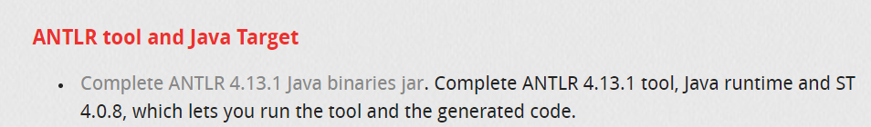

Como instalar o ANTLR com Python:

(Certifique-se de ter o Java e o Python instalados em seu computador)
Nesse link:
https://www.antlr.org/download.html
Você deve baixar esse arquivo .jar
OBS: Caso o arquivo venha com o icone do winrar ou .zip NÃO descompacte.

Ao baixar basta executar o comando dentro do console da sua pasta que contenha o arquivo .g4:

java -jar antlr-4.13.1-complete.jar -Dlanguage=Python3 SeuArquivo.g4

Assim será gerado uma serie de arquivos baseados no conteudo e gramatica do arquivo .g4

Recomendavel que toda vez que holver alteração no arquivo .g4 execute o comando novamente para que o código gerado se adapte aos novos conteudos.

